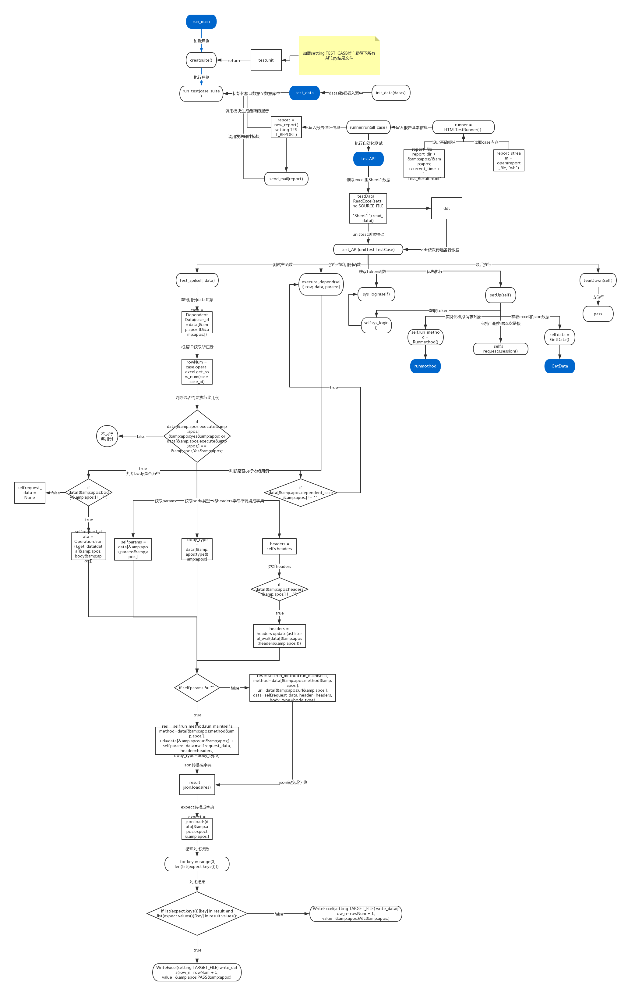

## 主要说明
本测试框架，环境使用python3+unittest试框架及ddt数据驱动，采用Excel管理测试用例等集成测试数据功能，
以及使用HTMLTestRunner来生成测试报告，报告生成后可自动发送邮件并附带附件。

## 测试框架处理流程

测试框架处理过程如下：
* 首先初始化清空数据库表的数据，向数据库插入测试数据；
* 调用被测试系统提供的接口，先数据驱动读取excel用例一行数据；
* 每次执行用例时都将执行一次登录获取token操作；
* 发送请求数据，根据传参数据，向数据库查询得到对应的数据；
* 将查询的结果转换成dict格式的数据，同时根据返回的数据值与Excel的值（也转成dict）对比判断，依次判断key与value，
  并写入结果至指定Excel测试用例表格；
* 若存在依赖接口先执行依赖接口，根据依赖接口返回数据，组装成本次接口数据并发送；
* 通过单元测试框架断言接口返回的数据，并生成测试报告，最后把生成最新的测试报告HTML文件发送指定的邮箱。

## 注意事项
由于修改ddt库中函数但是直接放在项目中调用报错，所以使用前需要修改本地的ddt文件
* 具体修改操作如下：
* 1.找到ddt.py
* 2.找到函数def mk_test_name(name, value, index=0, name_fmt=TestNameFormat.DEFAULT):
* 3.将 # Add zeros before index to keep order至函数结束的代码替换
* 4.替换内容：

    # 测试用例名称读取 case_name 字段的值 start --Victor
    # 添加了对字典数据的处理。
    index = "{0:0{1}}".format(index + 1, index_len)
    if name_fmt is TestNameFormat.INDEX_ONLY or not is_trivial(value) and type(value) is not dict:
        return "{0}_{1}".format(name, index)
    # 如果数据是字典，则获取字典当中的api_name对应的值，加到测试用例名称中。
    if type(value) is dict:
        try :
            value = '用例id：' + value['ID'] + '用例名称：' + value['UseCase']
        except:
            return "{0}_{1}".format(name, index)

    try:
            value = str(value)
    except UnicodeEncodeError:
        # fallback for python2
        value = value.encode('ascii', 'backslashreplace')
    test_name = "{0}_{1}_{2}".format(name, index, value)
    return re.sub(r'\W|^(?=\d)', '_', test_name)

## 测试框架结构目录及文件介绍
目录结构介绍如下：
* config/:                 存放基础配置信息
*** config.ini                   填写测试人员、数据库信息、邮件登录信息
*** global_var.py                定义全局变量与excel的对应关系
*** setting.py                   获取对应文件的路径信息
* database/:               存放测试所有到的所有数据信息
*** api_json.json                存放excel中body关键字对应的json数据
*** APITestCase.xlsx             存放测试用例数据
*** test_data.py                 存放插入数据库数据
* lib/:                    程序核心模块，个人封装的模块和修改的第三方库
* report/:                 存放生成接口自动化测试报告及excel
** excelReport/:               存放测试后的excel
* testcase/:               用于编写接口自动化测试用例
*** Automation_API.py            测试用例主要模块
* run_demo.py:             执行所有接口测试用例的主程序

## APITestCase各列说明
* module：用例所属模块
* ID：用例ID，用于报表显示
* UseCase：用例名称（描述），用于报表显示
* url：接口url，不含参数！
* method：接口发送方式，选填get、Get、post、Post，填写其他将无法执行
* headers：接口所需header，无特殊要求默认不填，以字典形式填写，如：{"Content-Type": "json"}，多个键值对以‘，’分割
* params：本次接口所需参数，以‘?’开头key=value形式填写&拼接，如：?gradeIds=0003&pageNo=0&pageSize=20
* body：填写api_json对应关键字
* type：json取出数据发送类型，可填json，填写json数据将格式化为json数据发送，否则为text
* dependent_case：依赖用例id，填写需要执行的依赖用例id，执行本条用例前将先执行依赖用例，只可填写1个id
* dependent_response：从依赖用例执行后返回结果中取得本次用例执行所需的数据，用key取得value，各key以‘,’分割，
                      获取对应的value只保留第一个
* dependent_field：本次用例发送数据的key，各key以‘,’分割
* depend_field_type：获取value发送时转换类型，可填list、str，填写其他将无法执行，各类型以‘,’分割
* depend_type：执行依赖后本次获取到key及value发送方式，选填body、params，填写其他将无法执行
* execute：本用例是否执行，选填yes、Yes，填写其他将不执行次用例
* expect：预期结果，以字典形式填写，如：{"msg":"成功"}，多个键值对以‘,’分割，程序依次判断返回结果是否还有键值对
* result：输出报告预留测试结论空位，不用填写
* testers：输出报告预留测试人员空位，不用填写
#关于APITestCase特殊说明#
* APITestCase内所有符号使用英文符号，中文符号无法识别
* dependent_response、depend_field_type、depend_field_type，三个对应顺序及数量要一致，否则程序无法执行

## api_json说明
* json文件中最外层{}不可改变，保证json格式正确，添加数据以键值对形式添加，键为APITestCase中body填写关键字以‘""’包裹，
* 值为body需要发送数据，同样以键值对格式填写中间以‘,’分割，键值对中间以‘:’连接，具体格式如下：

        {
        "Sendtemperaturedata": {
            "id": "1",
            "school_id": "1101010001",
            "grade_id": "0012",
            "class_id": "157767527483843139",
            "student_number": "110101000100841",
            "thermal_serial": "301F9A68F98A",
            "day": "2020-06-29",
            "temp": "36.9",
            "status": 0
          }
        }
#关于api_json特殊说明#
* api_json内所有符号使用英文符号，中文符号无法识别

## Automation_API说明
* setUP():每次执行用例前都将执行一次
* tearDown():每次执行用例后都将执行一次
* execute_depend():执行依赖用例时将执行
* sys_login():获取token
* test_api():执行case并生成excel报告
